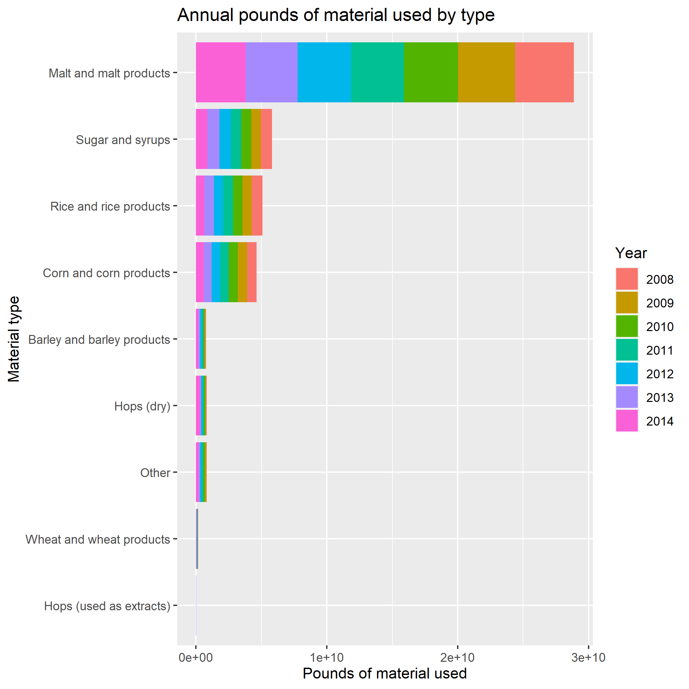
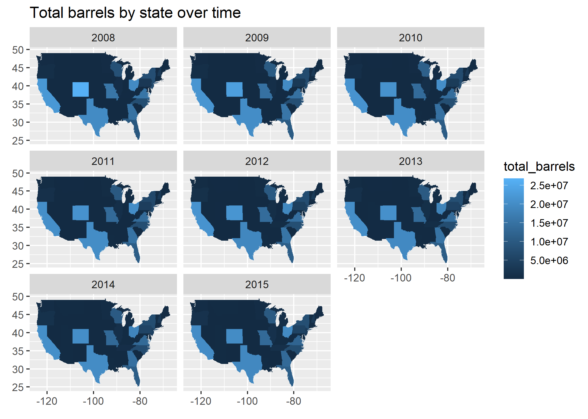

### Instructions

Your solutions must be written in an R Markdown (Rmd) file called `lab-02.Rmd`. This file must include your code and write up for each question. Your “submission” will be whatever is in your lab repository at the deadline. All labs not submitted through GitHub will receive a 20 point penalty. In order to receive full credit, your notebook must knit to HTML without any errors.

This lab is open book, open internet, closed other people. You may use any online or book based resource you would like, but you must include citations for any code that you use. You may not consult with anyone else about this lab other than the Professor or TA for this course.

You have until 11:59pm on Sunday, November 14 to complete this lab and turn it in via your personal GitHub repo - late work will not be accepted. Technical difficulties are not an excuse for late work - do not wait until the last minute to knit / commit / push.

**On questions asking you to produce a graph, be sure to include an appropriate title and labels. Graphs should include a brief (one or two sentence) narrative describing the graph and what it reveals about the data.** For this lab, you can only use base R and the `tidyverse` package (`dplyr`, `readr`, `ggplot`, etc.).


### Getting help

You are not allowed to post any questions regarding specific solutions on the Canvas Discussion board. General questions such how to debug GitHub errors, or how to interpret a question on the lab are okay. If you're unsure if a question is "general", don't post it. Non-general questions about the lab must be asked during office hours or via email to the Professor or the TA.

### Grading and feedback

The total points for the questions add up to 90 points. The remaining 10 points are allocated to code style, overall organization, spelling, grammar, etc. There is also an extra credit question that is worth 10 points. You will receive feedback as an issue posted to your repository, and your grade will also be recorded on Canvas.

### The data

The two data files can be found inside the `data` folder in the main directory. Both data sets are aggregated from the [Alcohol and Tobacco Tax and Trade Bureau](https://www.ttb.gov/beer/statistics). The `brewing_materials` dataset contains information about the quantity of materials used for alcohol production and `beer_states` contains information about the amount of alcohol produced by state.

### Questions

```{r setup}
library(tidyverse)
```

**Question 1 (5 points)**: Using the `readr` package, load the file `data/brewing_materials.csv` into R and assign it to a variable `brewing_materials`. Additionally, load the file `data/beer_states.csv` into R and assign it to a variable `beer_states`.

```{r}
brewing_materials <- read_csv("data/brewing_materials.csv")
beer_states <- read_csv("data/beer_states.csv")
```
**Question 2 (25 points)**: Create a column plot (`geom_col`) of the annual pounds of material used by `type`. Material type should be along the y-axis and pounds of material used should be along the x-axis. The y-axis should be sorted by the total pounds of material used across all years in the data set. Within each material type column, set the fill using `year` of the data. An example of the expected output is below.



```{r}
brewing_materials %>%
  filter(!str_detect(material_type, "Total"), month == 12) %>%
  arrange(ytd_current) %>%
  mutate(type = factor(type, levels = unique(type))) %>%
  ggplot(aes(x=type, y = ytd_current, fill=as_factor(year))) +
  geom_col() +
  coord_flip() +
  labs(
    title = "Annual pounds of material used by type",
    y = "Pounds of material used",
    x = "Material type",
    fill = "Year"
  )
```

**Question 3 (5 points)**: Add a new variable, `date`, to bring together the `year` and `month` into a date variable. *Hint: Your date variable can assume it is the first day of month*.

```{r}
brewing_materials <- brewing_materials %>%
  mutate(date = as.Date(paste(year, month,"1", sep="-")))
```

**Question 4 (20 points)**: Create a line plot of pounds of material used (`month_current`) for `"Wheat and wheat products"` and `"Barley and barley products"` (`type`) by `date`. Each material should be it's own line.

```{r}
brewing_materials %>%
  filter(type %in% c("Wheat and wheat products", "Barley and barley products")) %>%
  ggplot(aes(x = date, y = month_current, color=type)) +
  geom_line() +
  labs(
    title = "Materials used over time",
    x = "Date",
    y = "Materials used (lbs)"
  )
```

**Question 5 (25 points)**: Create a map plot of total barrels produced by state per year. The fill of each state should be determined based on the sum of barrels produced in a year from all `type`s. The figure should be faceted by year. An example of the expected output is below.



```{r}
map <- ggplot2::map_data("state")
beer_states %>%
  group_by(state, year) %>%
  summarise(total_barrels = sum(barrels)) %>%
  ggplot(aes(fill = total_barrels)) +
  geom_map(aes(map_id = state), map = map) +
  expand_limits(x = map$long, y = map$lat) +
  facet_wrap(~year) +
  labs(
    title = "Total barrels by state over time",
    x = element_blank(),
    y = element_blank()
  )
```

**Question 6 (10 points)**: Explain why a linear regression residual, $e_i = y_i - \hat{y}_i$, is only an estimate of the regression model's true error for the $i^{th}$ observation.

**Extra Credit (10 points)**: Review your plot from *Question 4* and notice the cyclical pattern of values. When studying time series, data scientists often remove the seasonal component in order to study the underlying trend. One method to smooth through the seasonal trend is to calculate a moving average. A moving average of order $m$ can be written as

$$
\hat{y}^{MA_m}_i = \frac{1}{m}\sum^k_{j=-k}y_{t+j}
$$
where $m = 2k + 1$. That is, the estimate of the trend-cycle at time $t$ is obtained by averaging values of the time series within $k$ periods of $t$. Observations that are nearby in time are also likely to be close in value. We call this an $m$**-MA**, meaning a moving average of order $m$.

Create a function `moving_average` which takes a vector of values `Y` and an order parameter `m` and returns the $m$**-MA** moving average transformation of the vector. For this question assume that `m` is an odd, positive integer less than the length of `Y`.

After creating your function, reproduce the plot from Question 4 using only the `"Wheat and wheat products"` type. On the plot, include the `13-MA` moving average line (i.e. moving average of order 13). 

```{r}
moving_average <- function(Y, m) {
  k <- (m - 1) / 2
  ma <- vector("double", length(Y)) # preallocate vector or performance
  ma[1:k] <- NaN
  ma[(length(Y)-k + 1):length(Y)] <- NaN
  
  for (i in (k+1):(length(Y)-k)){
    ma[[i]] <- sum(Y[(i-k):(i+k)]) / m
  }
  return(ma)
}
```
```{r}
brewing_materials %>%
  filter(type == "Wheat and wheat products") %>%
  mutate(`13-MA` = moving_average(month_current, 13)) %>%
  ggplot(aes(x = date)) +
  geom_line(aes(y = month_current)) +
  geom_line(aes(y = `13-MA`), colour = "#D55E00") +
  labs(
    title = "Annual pounds of material used by type",
    y = "Pounds of material used",
    x = "Material type"
  )
```

